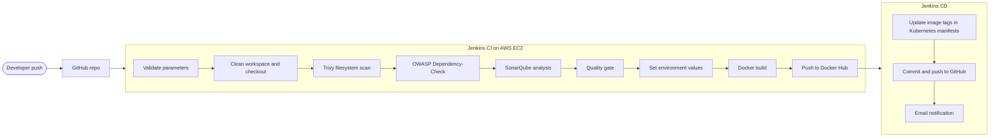

# DevSecOps CI/CD Pipeline with Jenkins

A Jenkins pipeline on AWS EC2 that checks out a MERN application, runs security scans (Trivy, OWASP Dependency-Check, SonarQube), builds and pushes Docker images, and then updates the Kubernetes manifests through a separate CD job.

> **Demo:** [add your 60-90 second screen recording link here]

## What it does

- **CI job** - validates inputs, cleans the workspace, checks out the code, scans it, builds two Docker images (frontend and backend) and pushes them to Docker Hub.
- **Security checks built into the pipeline**
  - **Trivy** - scans the file system for vulnerable dependencies (HIGH and CRITICAL).
  - **OWASP Dependency-Check** - matches third-party libraries against the NVD database (uses an NVD API key).
  - **SonarQube** - static code analysis with a quality gate, reported back to Jenkins through a webhook.
- **CD job** - triggered by CI after a successful push. Updates the image tags in the Kubernetes manifests, commits the change to GitHub, and sends an email notification.
- **Jenkins Shared Library** - the pipeline steps live in a reusable library, so each Jenkinsfile stays short.

## Architecture

## Tech stack

| Area | Tools |
|---|---|
| CI/CD | Jenkins (Pipeline from SCM, Shared Library in Groovy) |
| Security | SonarQube Community, OWASP Dependency-Check, Trivy |
| Containers | Docker, Docker Hub |
| Infrastructure | AWS EC2 (Ubuntu), security groups, Elastic IP |
| Source control | GitHub (separate repos for app, library and this showcase) |
| Application | Wanderlust (MERN blog app, open source) |

## Repositories

| Repo | Purpose |
|---|---|
| This repo | Documentation, screenshots, copies of the Jenkinsfiles, helper scripts |
| [Shared-Library-Jenkins](https://github.com/ArslanNagori/Shared-Library-Jenkins) | Reusable pipeline steps: `clean_workspace`, `clone_code`, `trivy_scan`, `owasp_dependency`, `sonarqube_analysis`, `sonarqube_code_quality`, `docker_build`, `docker_push`, `docker_compose` |
| [Wanderlust](https://github.com/ArslanNagori/Wanderlust) | Application code with the CI `Jenkinsfile` and the CD `GitOps/Jenkinsfile` |

## Pipeline stages

**CI (`jenkins/Jenkinsfile-ci`)**

| # | Stage | What happens |
|---|---|---|
| 1 | Validate Parameters | Fails early if the image tags are empty |
| 2 | Workspace cleanup | Starts every run from a clean workspace |
| 3 | Git checkout | Clones the application repo |
| 4 | Trivy filesystem scan | HIGH and CRITICAL findings, saved as `trivy-fs-report.txt` |
| 5 | OWASP Dependency-Check | XML and HTML reports, published in Jenkins |
| 6 | SonarQube analysis | Uploads the analysis to the SonarQube server |
| 7 | Quality gate | Waits for the gate result sent back by webhook |
| 8 | Environment values | Writes the server address into the frontend and backend env files (parallel) |
| 9 | Docker build | Builds the backend and frontend images |
| 10 | Docker push | Pushes both images to Docker Hub |
| Post | Archive and trigger CD | Archives scan reports, then starts the CD job |

**CD (`jenkins/Jenkinsfile-cd`)** validates the tags, updates `kubernetes/backend.yaml` and `kubernetes/frontend.yaml`, commits the change (only when something changed) and pushes it to GitHub.

## Screenshots

| | |
|---|---|
|  |  |
| CI pipeline stage view | Build history |
|  |  |
| SonarQube dashboard | OWASP Dependency-Check report |
|  |  |
| Trivy report | Images pushed to Docker Hub |
|  |  |
| CD job and the manifest commit | Shared library configuration |

## Results and notes

- The first Trivy scan of the baseline application reported **69 HIGH/CRITICAL findings** in npm dependencies (4 critical). The pipeline reports them without failing the build.
- The first Dependency-Check run downloaded about 400,000 NVD records and took roughly 39 minutes. The data is kept in a persistent folder, so later runs skip the download and finish in seconds.
- Problems hit while building this, with causes and fixes, are in [docs/troubleshooting.md](docs/troubleshooting.md).

## Run it yourself

1. Follow [docs/setup-guide.md](docs/setup-guide.md) to prepare the EC2 instance and Jenkins.
2. Use `scripts/install-tools.sh` for the tool installation.
3. Create the two jobs from `jenkins/Jenkinsfile-ci` and `jenkins/Jenkinsfile-cd`.
4. Run the CI job with **Build with Parameters** and tags such as `v1`. The very first run fails at "Validate Parameters" because Jenkins only learns the parameters after a run.

## Security and cost notes

- Ports 22, 8080 and 9000 are open to my IP only. Nothing is exposed to the public internet.
- Secrets (NVD key, Docker Hub token, GitHub token, SonarQube token) live in Jenkins credentials, never in the repo.
- The instance is stopped when not in use to save cost.

## Next steps

- Make the gates enforcing (fail the build on a red quality gate and on CRITICAL findings).
- Deploy the updated manifests with ArgoCD on a Kubernetes cluster.
- Provision the infrastructure as code.

## Credits

The Wanderlust application and its Kubernetes manifests come from the open-source [Wanderlust-Mega-Project](https://github.com/LondheShubham153/Wanderlust-Mega-Project) by LondheShubham153. The pipeline, shared library, scripts and documentation in these repos are my own work.

## Author

Arslan Nagori - [LinkedIn](https://linkedin.com/in/arslannagori)
