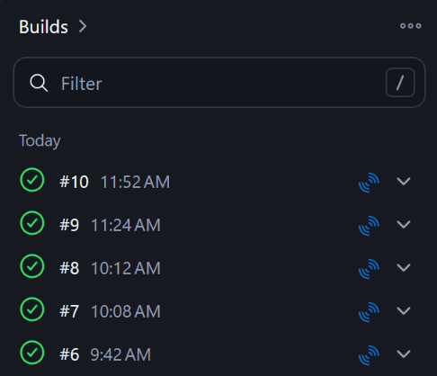
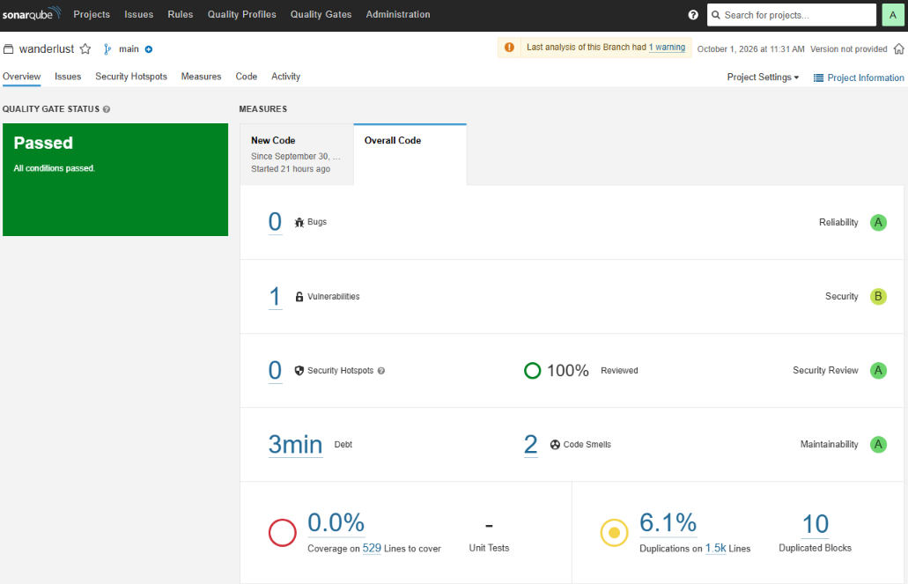
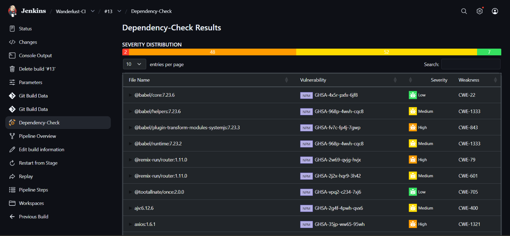
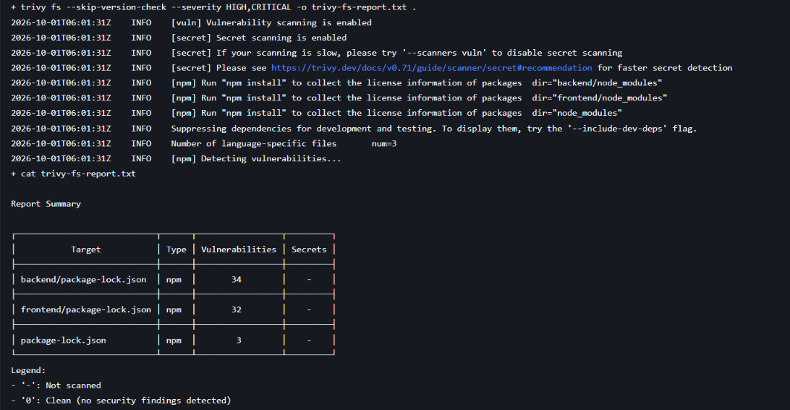
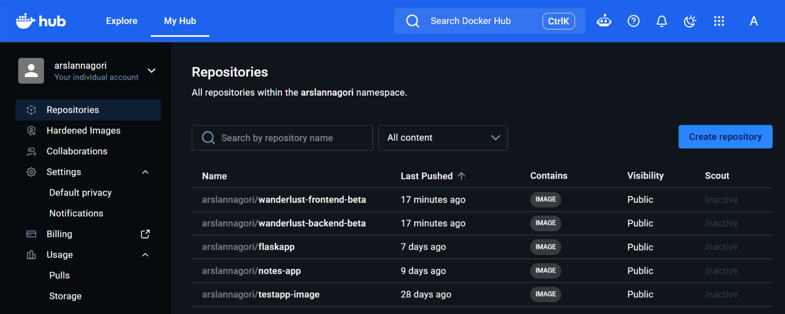
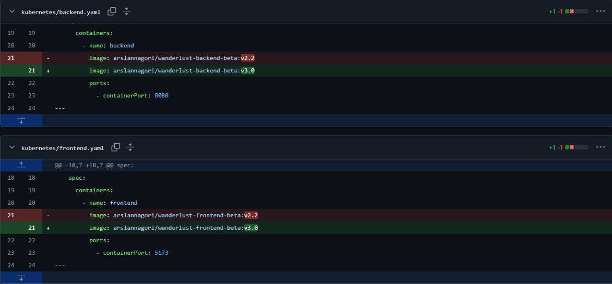
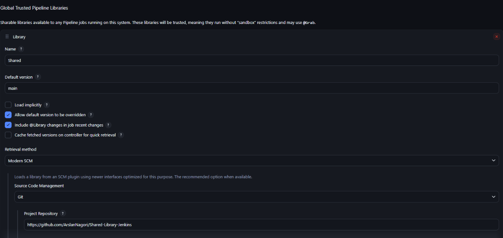

# DevSecOps Pipeline — Screenshots

This folder contains visual evidence of the **Wanderlust DevSecOps CI/CD implementation**.

The screenshots cover the Jenkins CI pipeline, security and code-quality checks, Docker image publishing, GitOps/CD updates, and Jenkins Shared Library configuration.

## CI Pipeline Evidence

### 01 — Jenkins Stage View

Jenkins Stage View showing the CI pipeline stages and their execution times.

---

### 02 — Build History

Jenkins build history showing multiple successful pipeline runs.

---

### 03 — SonarQube Dashboard

SonarQube project dashboard showing the Quality Gate result and code-quality metrics.

---

### 04 — OWASP Dependency-Check

Dependency-Check results displayed in Jenkins, showing detected dependency vulnerabilities and their severity levels.

---

### 05 — Trivy Filesystem Scan

Trivy filesystem scan summary showing vulnerabilities detected in the project's npm dependencies.

---

### 06 — Docker Hub Images

Docker Hub repositories showing the Wanderlust backend and frontend images pushed by the CI pipeline.

---

## CD / GitOps Evidence

### 07 — CD Job and Manifest Commit

#### CD Job Result

Shows the CD pipeline commit created by Jenkins after updating the Kubernetes manifests.

#### Kubernetes Manifest Changes

Shows the changes made to `backend.yaml` and `frontend.yaml`, including the updated Docker image tags.

Evidence of the CD/GitOps workflow:

- Jenkins updates the Kubernetes image tags.
- The updated `backend.yaml` and `frontend.yaml` are committed to GitHub.
- The Kubernetes manifests reference the required Docker image tags.

---

## Jenkins Shared Library

### 08 — Global Trusted Pipeline Library

Jenkins configuration showing the **Shared** global trusted pipeline library and its GitHub repository.

---

## Screenshot Checklist

| File | Evidence |
|---|---|
| `01-ci-stage-view.png` | Jenkins CI Stage View |
| `02-build-history.png` | Jenkins build history |
| `03-sonarqube-dashboard.png` | SonarQube Quality Gate and metrics |
| `04-dependency-check-report.png` | OWASP Dependency-Check results |
| `05-trivy-report.png` | Trivy vulnerability scan |
| `06-dockerhub-images.png` | Docker Hub repositories |
| `07-cd-job-and-manifest-commit.png` | CD/GitOps and Kubernetes manifest update |
| `08-shared-library-config.png` | Jenkins Shared Library configuration |

## Note

These screenshots are provided as implementation evidence for the DevSecOps pipeline. Sensitive information such as passwords, tokens, credential values, and private infrastructure details should be removed or masked before publishing.
